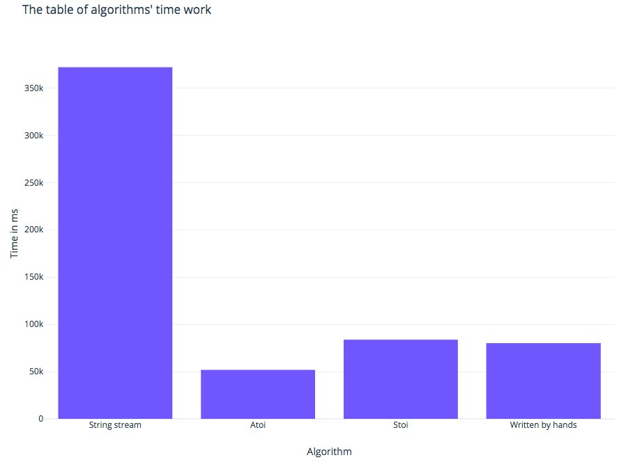

# CPP_Lab_2

## Introduction
This program reads the data from the file, convert it to integers and 
write to the new file their sum and average value.

## Installation and compilation
  ```bash
  $ git clone https://github.com/MarkiianAtUCU/CPP_Lab_2
  $ cd CPP_Lab_2
  $ mkdir build
  $ cd build
  $ cmake -G"Unix Makefiles" ..
  $ make
  ```
  
## Running

### CPP File
  (Insdite the "build" directory)
  ```bash
  $ ./Lab2 <number of method> <input file> <output file>
  ```
  
### Python script
  (Inside the "CPP_Lab_2" directory)
  ```bash
  $ python3 runScript.py <range> <input file> <output file>
  ```

## The table of the working time of each method.



## License and copyright
© Markiian Matsyuk and Serhiy Rosovskyy, students of the Ukrainian Catholic University
